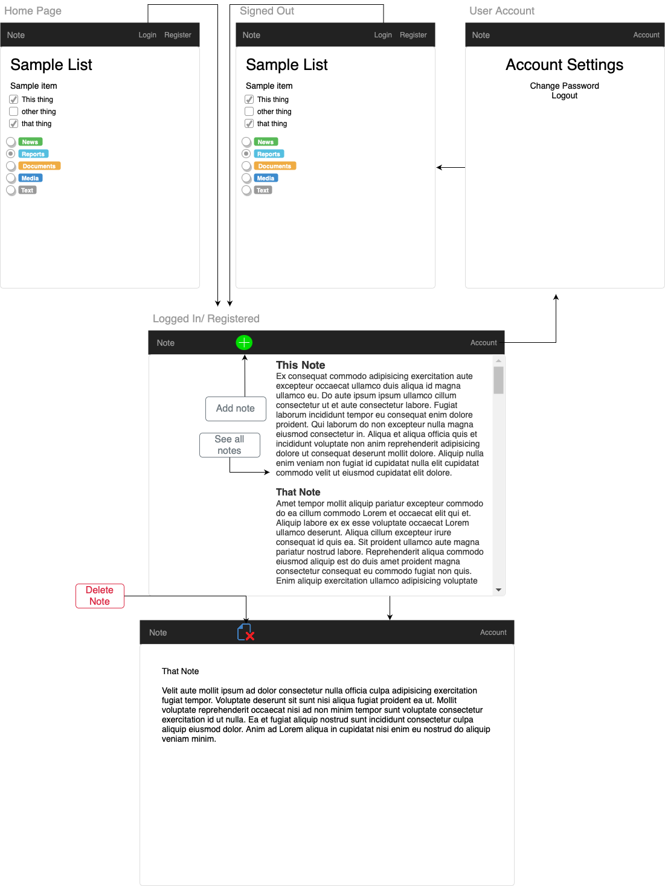

 # Note
This is the Front end for our Note taking app.  


## `Setup Steps`
1. Fork and clone this repository into your projects location 
   - `git clone git@github.com:<your github account name here>/react-material-design.git`
2. Create a new branch, and name it after your project. 
2. Checkout to your newly created branch.
   - `git checkout -b <your projects name here>`
4. Install dependencies with ```npm install```.

## `Important Links`
- [API Source Code](https://github.com/hernandoit/express-api-note)
- [Deployed API](https://protected-river-47536.herokuapp.com/)
- [Deployed Client Source Code](https://github.com/hernandoit/note-client)
- [Deployed Client](https://hernandoit.github.io/note-client/)


## `Planning Story`

#### `Auth Specifications`

 - Signup with email, password, and password confirmation.
 - Login with email and password.
 - Logout when logged in.
 - Change password with current and new password.
 - Signup and Signin must only be available to not signed in users.
 - Logout and Change password must only be available to signed in users.
 - Give feedback to the user after each action's success or failure.
 - All forms must clear after submit success and user sign-out


#### `CRUD Specifications`

 - User must be able to create a new resource
 - User must be able to update a resource
 - User must be able to delete a resource
 - User must be able to view a single or multiple resource(s)
 - All resource actions that change data must only be available to a signed in user.
 - Give feedback to the user after each action's success or failure.
 - All forms must clear after submit success and user sign-out

 #### `API Specifications`

 - Build an API using Express and Mongodb.
 - Create at least 4 RESTful routes for handling GET, POST, PUT/PATCH, and DELETE requests.
 - Any actions which change data must be authenticated and the data must be "owned" by the user performing the change.
 - Have at least 1 resource that has a relationship to User

#### `User Stories`

- As a end user, I want to have an account
- As a end user, I want to sign up
- As a end user, I want to sign in
- As a end user, I want to reset my password
- As a end user, I want to sign out
- As a end user, I want to create a new note
- As a end user, I want to see all of my notes
- As a end user, I want to delete a note
- As a end user, I want to update a note

#### `Technologies Used`
- GitHub
- HTML5
- CSS3
- JavaScript
- Material.io

#### `Unsolved Problems`
   1. Would like to eventually have individual folders to have to notes in.
   2. Would like to eventually start a note without signing in, and save that note when registered

## `Images`

